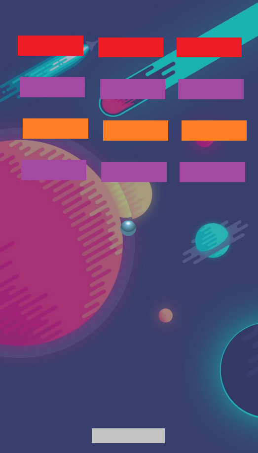
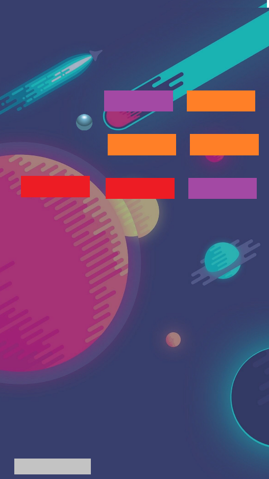

# Brick Breaker

> Game about destroying brick wall by deflecting bouncing ball with a paddle.

---

### Table of Contents
You're sections headers will be used to reference location of destination.

- [Description](#description)
- [How To Play](#how-to-use)
- [Learned](#learned)
- [Author Info](#author-info)

---

## Description
Game starts with ball bouncing down to the paddle in random direction with set power. Player has 3 lifes and he loses one of them if ball hits the bottom of the screen. He moves on to another level if all the bricks are destroyed. Bricks have set amout of durability:
- Orange brick - destroyed with 1 hit.
- Red brick - destroyed with 2 hits.
- Purple brick - destroyed with 3 hits.

---

## How To Play
> A move paddle to the left | D move paddle to the Right

---

## Learned
- Managing levels/scenes
- Building point system 
- How to add Player Lifes 
- Object "States"

---

## Author Info

- Twitter - [@MarceliKumiers1](https://twitter.com/MarceliKumiers1)
- LinkedIn - [Marceli Kuśmierski](https://www.linkedin.com/in/marceli-ku%C5%9Bmierski-321969165/)

[Back To The Top](#Brick-Breaker)
